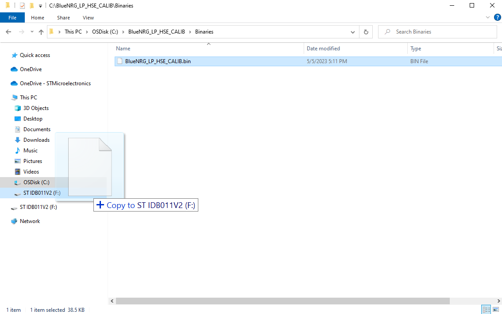
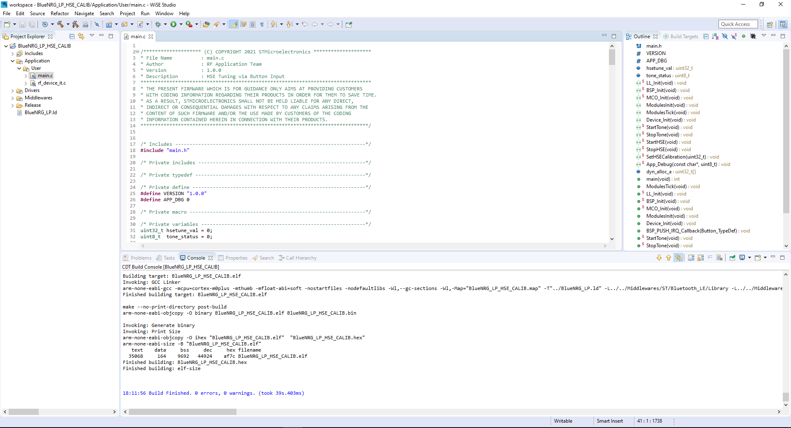
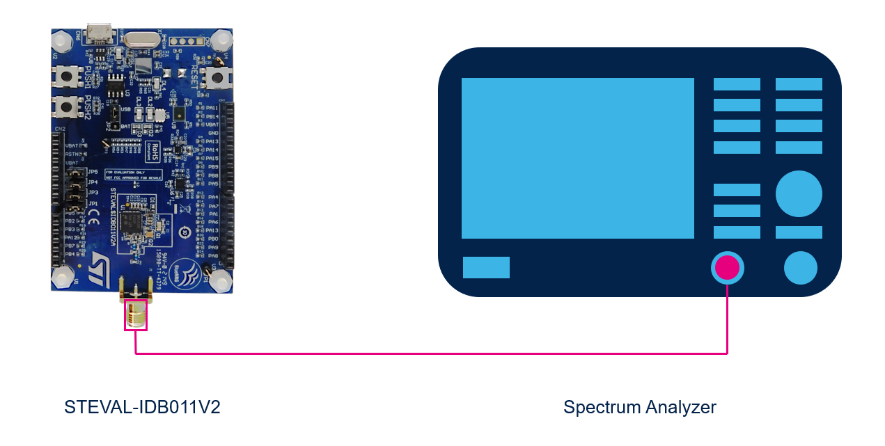
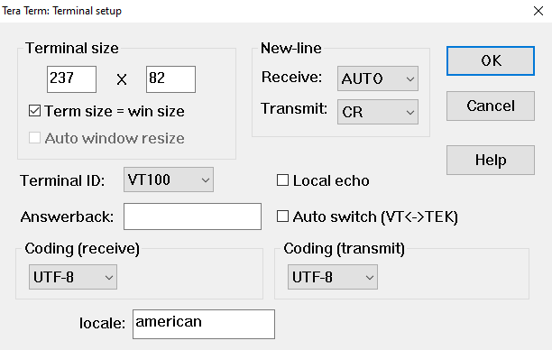
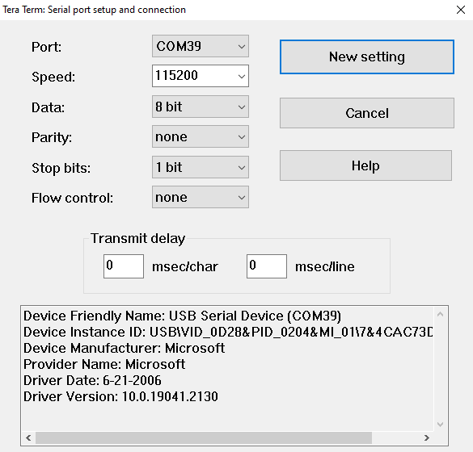
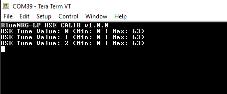
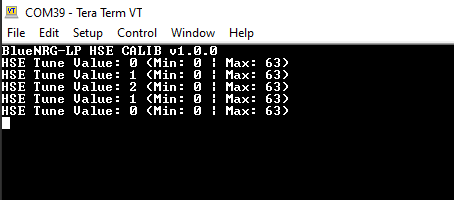
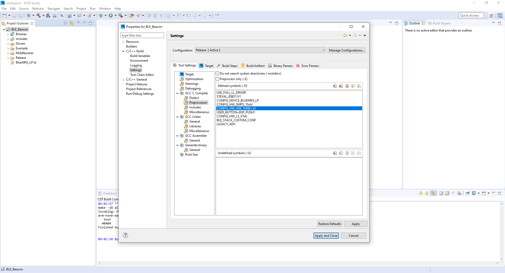

# BlueNRG-LP-HSE-CALIB
 
* The BlueNRG-LP-HSE-CALIB is an application example that allows the user to tune the High Speed External (HSE) crystal by adjusting 2 internal capacitors via the on-board buttons.
    * This application may be used to find the optimal HSE tune value for your PCB. This value can then be set with the CONFIG_HW_HSE_TUNE preprocessor symbol on your BlueNRG projects.
* The RF frequency is dependent on the HSE. Tuning of the HSE can be done by measuring the HSE clock or RF frequency.
* The HSE clock is output on the Microcontroller Clock Output (MCO) pin: PA11.
    * Use a frequency counter to measure the HSE frequency on the MCO pin.
* An RF tone at 2.402 GHz is started automatically at application start and after each change made to the HSE tune value.
    * A spectrum analyzer can be used to measure the tone peak, follow section 5.5 in [AN5503](https://www.st.com/resource/en/application_note/an5503-bringing-up-the-bluenrglp-bluenrglps-devices-stmicroelectronics.pdf) to configure the analyzer.
* This application example is based on the RCC_HSE_Calib application for the STM32WB55 found in the [X-CUBE-CLKTRIM](https://www.st.com/en/embedded-software/x-cube-clktrim.html) expansion package.

## Hardware Needed

* One [STEVAL-IDB011V2](https://www.st.com/en/evaluation-tools/steval-idb011v2.html) (BlueNRG-LP)

* One Frequency Counter (Necessary for HSE Frequency Measurment)

* One Spectrum Analyzer (Necessary for RF Frequency Measurment)

## Software Needed

* Prebuilt firmware image: [BlueNRG-LP-HSE-CALIB.bin](/Binaries)

* [WISE Studio](https://www.st.com/en/embedded-software/stsw-wise-studio.html), [IAR EWARM](https://www.iar.com/products/architectures/arm/iar-embedded-workbench-for-arm/), or [Keil MDK-ARM](https://developer.arm.com/Tools%20and%20Software/Keil%20MDK) IDE

* [Tera Term](https://ttssh2.osdn.jp/index.html.en) (Terminal Emulator)

## User Guide

1) Flash the application firmware on to the board using one of the following options:

    a) Drag and drop the prebuilt binary file onto the board in the file explorer.

    

    b) Open your preferred IDE and build & run the project to download it on to the board.

    

2) Connect to one of the following devices to measure the HSE or RF frequency:

    a) HSE: Connect the MCO pin (PA11) and the GND pin to a frequency counter.

    

    b) RF: Connect the board to a spectrum analyzer directly with an SMA cable or wirelessly with RF antennas.

    > **Note:** The antennas should be placed closely together. Follow section 5.5 in [AN5503](https://www.st.com/resource/en/application_note/an5503-bringing-up-the-bluenrglp-bluenrglps-devices-stmicroelectronics.pdf) to configure the analyzer.

    

3) Open and configure Tera Term with the following settings to view the HSE Tune Value:

    a) Terminal Setup
    
    * New-line Receive: AUTO

    * New-line Transmit: CR

    

    b) Serial Port Setup

    * Port: Select Board's COM Port

    * Speed: 115200

    * Data: 8 Bit

    * Parity: None

    * Stop Bits: 1 Bit

    * Flow Control: None

    

4) Use the buttons on the evaulation board to change the HSE tune value (0 - 63).

    a) PUSH Button 1: increases the HSE tune value.

    

    b) PUSH Button 2: decreases the HSE tune value.

    

5) Tune the HSE until you see the following HSE or RF frequency measurments.

    a) HSE Frequency: 32 MHz

    b) RF Frequency: 2.402 GHz

6) Take note of the optimal HSE tune value and set it using the CONFIG_HW_HSE_TUNE preprocessor symbol on your BlueNRG projects.

    > **Note:** The default CONFIG_HW_HSE_TUNE value is set to 32 for BlueNRG examples.

    

## Troubleshooting

**Caution** : Issues and the pull-requests are **not supported** to submit problems or suggestions related to the software delivered in this repository. The BlueNRG-LP-HSE-CALIB example is being delivered as-is, and not necessarily supported by ST.

**For any other question** related to the product, the hardware performance or characteristics, the tools, the environment, you can submit it to the **ST Community** on the STM32 MCUs related [page](https://community.st.com/s/topic/0TO0X000000BSqSWAW/stm32-mcus).